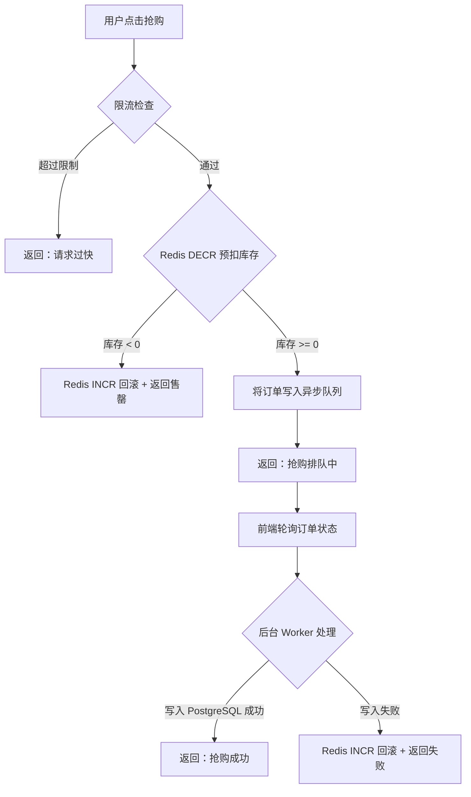

## 1. 产品概述

商品秒杀系统演示——用户登录后抢购限量商品，Redis 预扣库存防止超卖，异步写入数据库保证最终一致性，前端实时展示库存与抢购结果。

- 目标用户：对高并发秒杀场景感兴趣的开发者/学习者
- 核心价值：以最小可运行 Demo 展示秒杀系统关键架构模式（Redis 预扣 + 限流 + 异步落库）

## 2. 核心功能

### 2.1 用户角色

| 角色 | 注册方式 | 核心权限 |
|------|----------|----------|
| 普通用户 | 用户名注册/登录 | 浏览商品、参与秒杀、查看订单 |

### 2.2 功能模块

1. **登录页**：用户名密码登录，JWT Token 鉴权
2. **秒杀首页**：商品列表、实时剩余库存、抢购按钮、抢购结果反馈

### 2.3 页面详情

| 页面名称 | 模块名称 | 功能描述 |
|----------|----------|----------|
| 登录页 | 登录表单 | 用户名+密码输入，登录成功后跳转秒杀首页 |
| 秒杀首页 | 商品列表 | 展示秒杀商品名称、价格、总库存、剩余库存（轮询刷新） |
| 秒杀首页 | 抢购按钮 | 点击抢购，按钮在请求期间禁用，每用户每秒限一次 |
| 秒杀首页 | 结果提示 | 抢购成功/失败/售罄/限流 toast 提示 |
| 秒杀首页 | 我的订单 | 展示当前用户已抢到的商品列表 |

## 3. 核心流程

用户登录 → 浏览秒杀商品 → 点击抢购 → Redis 原子预扣库存（DECR） → 成功则进入异步订单队列 → 后台 Worker 写入 PostgreSQL → 前端轮询获取最终结果；若 Redis 库存不足则直接返回售罄。

## 4. 用户界面设计

### 4.1 设计风格

- 主色：鲜红 `#E53935`（秒杀紧迫感）+ 深灰 `#1A1A2E` 背景
- 辅助色：金色 `#FFD700`（促销氛围）、白色文字
- 按钮：圆角胶囊形，抢购按钮红色脉冲动画
- 字体：标题使用粗体大字号，数字使用等宽字体突出
- 布局：卡片式居中布局，顶部导航栏

### 4.2 页面设计概览

| 页面名称 | 模块名称 | UI 元素 |
|----------|----------|---------|
| 登录页 | 登录表单 | 深色背景卡片、输入框、红色登录按钮、轻微阴影 |
| 秒杀首页 | 商品列表 | 商品卡片网格、倒计时/库存进度条、脉冲抢购按钮 |
| 秒杀首页 | 结果提示 | 右上角 toast 弹出、绿色成功/红色失败/黄色限流 |
| 秒杀首页 | 我的订单 | 底部折叠面板、订单列表 |

### 4.3 响应式

桌面优先，移动端自适应（卡片单列），按钮触摸友好（最小 44px 触控区）
