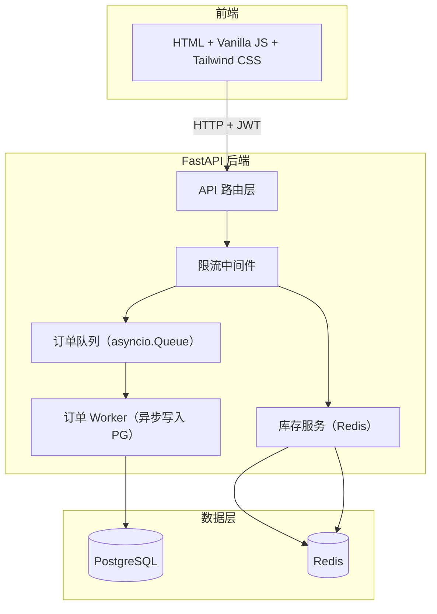
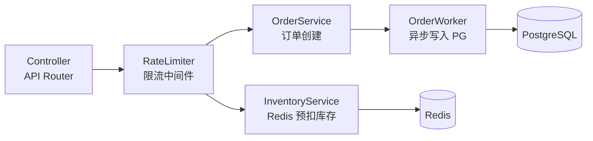
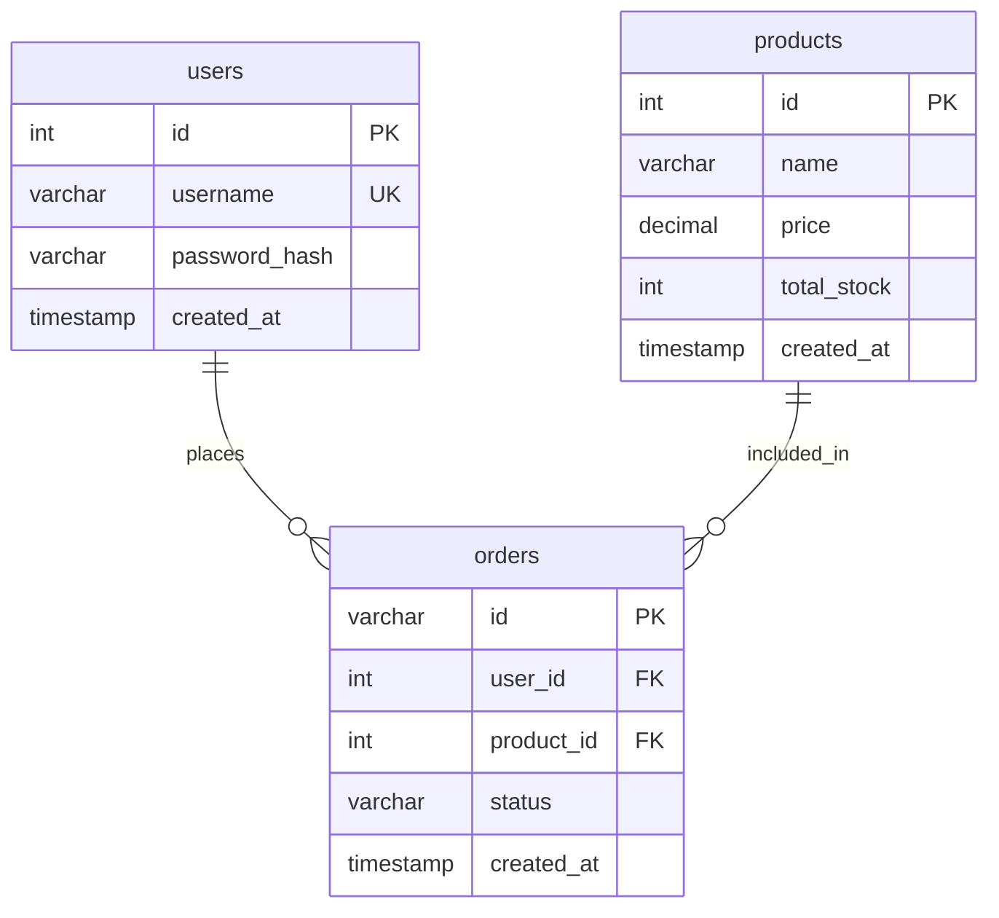

## 1. 架构设计



## 2. 技术说明

- 前端：纯 HTML + Vanilla JS + Tailwind CSS（由 FastAPI 静态文件服务）
- 后端：FastAPI (Python 3.11+)
- 数据库：PostgreSQL 15（用户、商品、订单持久化）
- 缓存/队列：Redis 7（库存预扣、限流计数）
- 异步任务：asyncio.Queue + 后台 Worker（无需 Celery，Demo 级别足够）
- 容器化：Docker Compose（PG + Redis + FastAPI）

## 3. 路由定义

| 路由 | 方法 | 用途 |
|------|------|------|
| `/` | GET | 秒杀首页（HTML） |
| `/login` | GET | 登录页（HTML） |
| `/api/auth/register` | POST | 用户注册 |
| `/api/auth/login` | POST | 用户登录，返回 JWT |
| `/api/products` | GET | 获取秒杀商品列表（含剩余库存） |
| `/api/seckill/{product_id}` | POST | 发起秒杀抢购 |
| `/api/seckill/result/{order_id}` | GET | 轮询秒杀结果 |
| `/api/orders` | GET | 获取当前用户订单列表 |

## 4. API 定义

```typescript
interface User {
  id: number
  username: string
}

interface Product {
  id: number
  name: string
  price: number
  total_stock: number
  remaining_stock: number
}

interface Order {
  id: string
  user_id: number
  product_id: number
  status: "pending" | "success" | "failed"
  created_at: string
}

interface SeckillRequest {
  product_id: number
}

interface SeckillResponse {
  code: number
  message: string
  order_id?: string
}

interface SeckillResultResponse {
  status: "pending" | "success" | "failed"
  product_name?: string
}

interface ApiResponse<T> {
  code: number
  data: T
  message: string
}
```

## 5. 服务端架构图



## 6. 数据模型

### 6.1 数据模型定义



### 6.2 数据定义语言

```sql
CREATE TABLE users (
    id SERIAL PRIMARY KEY,
    username VARCHAR(50) UNIQUE NOT NULL,
    password_hash VARCHAR(255) NOT NULL,
    created_at TIMESTAMP DEFAULT CURRENT_TIMESTAMP
);

CREATE TABLE products (
    id SERIAL PRIMARY KEY,
    name VARCHAR(100) NOT NULL,
    price DECIMAL(10, 2) NOT NULL,
    total_stock INTEGER NOT NULL,
    created_at TIMESTAMP DEFAULT CURRENT_TIMESTAMP
);

CREATE TABLE orders (
    id VARCHAR(36) PRIMARY KEY,
    user_id INTEGER REFERENCES users(id),
    product_id INTEGER REFERENCES products(id),
    status VARCHAR(20) DEFAULT 'pending',
    created_at TIMESTAMP DEFAULT CURRENT_TIMESTAMP
);

CREATE INDEX idx_orders_user_id ON orders(user_id);
CREATE INDEX idx_orders_status ON orders(status);

INSERT INTO products (name, price, total_stock) VALUES
    ('iPhone 16 Pro', 0.01, 100),
    ('MacBook Air M4', 0.01, 50),
    ('AirPods Pro 3', 0.01, 200);
```
